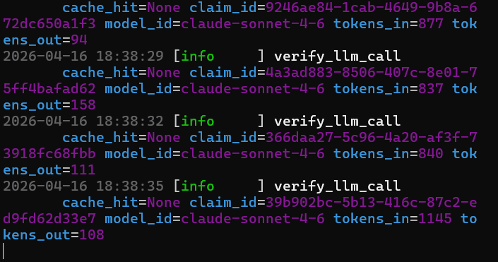
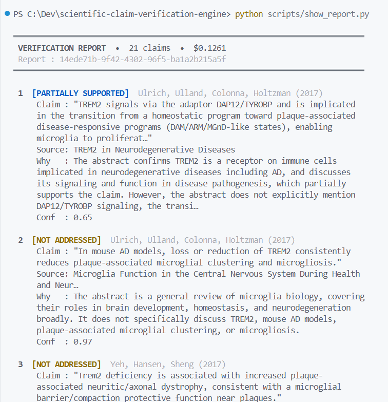
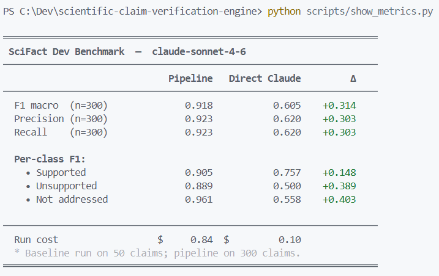

# Scientific Claim Verification Engine


Auditable, claim-by-claim verification of scientific text against cited sources.

## What it does

Takes free-form scientific text (paper excerpt, literature review, etc.) and outputs:

- A `report.json` with a verdict for each extracted claim (`supported` / `unsupported` / `partially_supported` / `not_addressed`)
- A `provenance.jsonl` with a full audit trail of every LLM call, token count, and cache hit

## Demo

Pipeline running on a real [Edison Scientific](https://edisonscientific.com) Literature agent output (TREM2 / Alzheimer's microglia):



Claim-by-claim verification report:



SciFact benchmark — pipeline vs. direct Claude (same model, no pipeline):



## Quick start

```bash
pip install -e ".[dev]"
export ANTHROPIC_API_KEY=sk-...
python examples/sample_run.py
```

Report files are written to `reports/runs/{report_id}/`.

### Run on Edison Scientific output

```bash
pip install -e ".[edison]"
export EDISON_API_KEY=...
python scripts/fetch_edison_sample.py "What is the role of TREM2 in Alzheimer's microglia?" --slug trem2
python examples/sample_run.py examples/inputs/edison_trem2.txt
python scripts/show_report.py
```

## Pipeline

```text
input text
    → extract_claims()     # LLM: extract verifiable claims with citations
    → resolve_citations()  # OpenAlex: find abstracts for each cited source
    → verify_claim()       # LLM: compare claim against abstract
    → build_report()       # Aggregate: write report.json + provenance.jsonl
```

## Public API

### `src.extract.extract_claims`

```python
def extract_claims(
    text: str,
    *,
    model_id: str = "claude-sonnet-4-6",
    api_key: str | None = None,
) -> tuple[list[Claim], ProvenanceStep]: ...
```

### `src.resolve.resolve_citations`

```python
def resolve_citations(
    claims: list[Claim],
    *,
    db_path: Path | None = None,
) -> tuple[dict[str, ResolvedSource], list[ProvenanceStep]]: ...
```

### `src.verify.verify_claim`

```python
def verify_claim(
    claim: Claim,
    source: ResolvedSource,
    *,
    model_id: str = "claude-sonnet-4-6",
    api_key: str | None = None,
) -> tuple[VerificationResult, ProvenanceStep]: ...
```

### `src.report.build_report`

```python
def build_report(
    report_id: str,
    input_text: str,
    claims: list[Claim],
    sources: dict[str, ResolvedSource],
    results: dict[str, VerificationResult],
    provenance_steps: list[ProvenanceStep],
    *,
    output_dir: Path | None = None,
) -> Path: ...
```

Returns the path to the run directory (`reports/runs/{report_id}/`).

## Data models

All models are frozen dataclasses defined in `src/models.py`:

- `Claim` — a single extracted claim with citation metadata
- `ResolvedSource` — result of an OpenAlex lookup (abstract, DOI, similarity score)
- `VerificationResult` — LLM verdict with confidence and explanation
- `ProvenanceStep` — audit record for one pipeline step (tokens, cache hit, model ID)

## Evaluation

```bash
python scripts/eval_scifact.py --split dev
```

Uses the SciFact dataset in `eval/scifact/`. The `test` split is locked — never use it during development.

### SciFact dev results (PoC baseline)

| Approach | F1 | Macro-F1 | Cost (50 claims) |
| --- | --- | --- | --- |
| **This pipeline** (structured system prompt + provenance) | **0.94** | **0.94** | $0.17 |
| Direct LLM (naive single prompt, same model) | 0.62 | 0.60 | $0.10 |

Full dev set (300 claims): F1 = **0.923**, Macro-F1 = **0.919**, total cost = $0.84.

Per-class F1 (300 claims): supported = 0.905 · unsupported = 0.889 · not\_addressed = 0.961.

Baseline locked at `eval/results/baseline_phase0.json`.

## Development

```bash
python -m pytest tests/unit/ -v          # 99 tests, all offline
python -m mypy --strict src/             # zero errors
python -m ruff check src/ tests/ scripts/
python -m ruff format src/ tests/ scripts/
```

## Cost estimate

Targeting < $0.10 per 2-page document.

- Input: $3.00 / M tokens
- Cached input: $0.30 / M tokens (prompt caching on all system prompts)
- Output: $15.00 / M tokens

Token costs are logged per call and summed in `report.json` under `summary.total_cost_usd`.

## Known limitations

The current pipeline (PoC) verifies claims against **paper abstracts only**. This has two structural consequences:

### Coverage by claim type

| Claim type | Verifiable with abstracts | Example |
| --- | --- | --- |
| Qualitative high-level | Partially | "TREM2 is implicated in microglial activation" |
| Specific quantitative | No | "KD = 86.50 nM", "p < 0.0001", "39% vs 11.5%" |
| Methodological | No | Exact experimental conditions, concentrations |

Quantitative and methodological claims are located in figures, tables, and methods sections — never in abstracts. This is a structural limitation of the data source, not the pipeline. Expect 60–70% `not_addressed` on dense scientific reports containing precise numerical findings.

### Resolver quality

OpenAlex fuzzy matching occasionally returns an incorrect paper (high similarity score, wrong study). This produces `not_addressed` verdicts that look like missing coverage rather than retrieval errors. The `similarity_score` field in the report is the primary diagnostic signal.

### Single-source verification

Each claim is verified against its cited source only. No cross-referencing against corroborating or contradicting literature.

---

## Future work

### Phase 1 — Full-text verification

Move from abstract-level to full-text verification, closing the coverage gap on quantitative and methodological claims.

- **CrossRef as fallback resolver** — reduces citation miss rate when OpenAlex returns no results
- **Full-text retrieval chain** — PubMed Central OA → Unpaywall → PDF → abstract fallback (with `fulltext_unavailable` flag)
- **Section-aware chunking** — IMRAD structure (Introduction / Methods / Results / Discussion) maps each claim to the relevant section; never sliding window
- **Passage selection** — BM25 top-3 chunks for focused verification
- **Source quotes in output** — exact sentences from the source paper supporting or contradicting the claim

### Phase 2 — Deterministic numerical engine

Catch quantitative errors that LLMs are structurally unreliable at detecting. The comparison step is 100% deterministic Python — no LLM calls.

- **Statistical consistency checker** — verifies that reported p-values are plausible given effect size and sample size (`scipy.stats`, `statsmodels`)
- **Unit and magnitude checker** — flags order-of-magnitude mismatches and unit errors (e.g. μM vs mM)
- **Percentage and ratio verification** — detects inverted ratios, incorrect percentages, multi-arm trial inconsistencies
- **Property-based testing** (`hypothesis`) — comparison engine is symmetric and deterministic on all inputs

---

## Contributing

Contributions are welcome. See [CONTRIBUTING.md](CONTRIBUTING.md) for setup, code style, and PR guidelines.

## License

Apache 2.0 — see [LICENSE](LICENSE).
