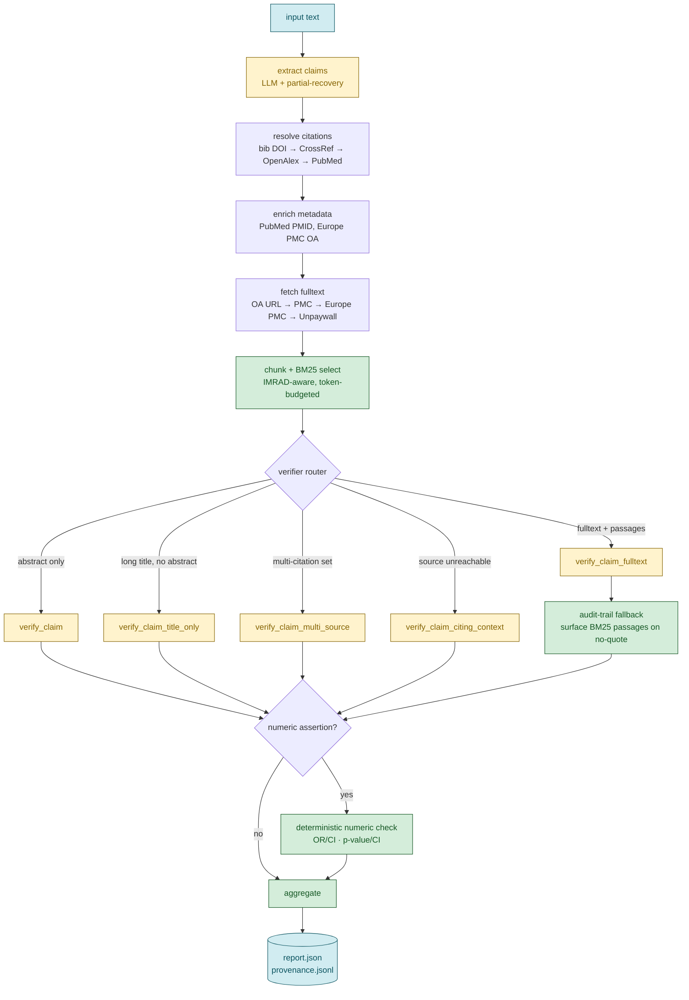
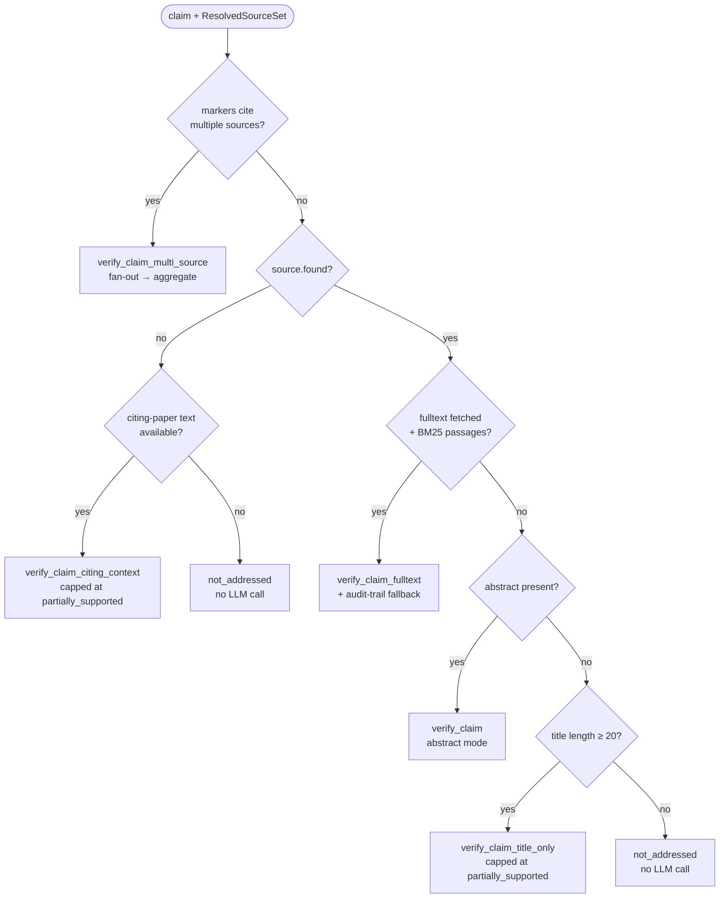
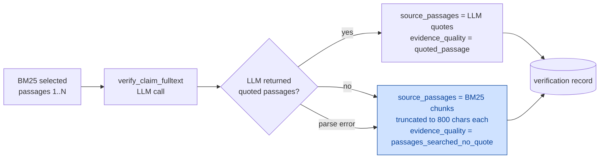
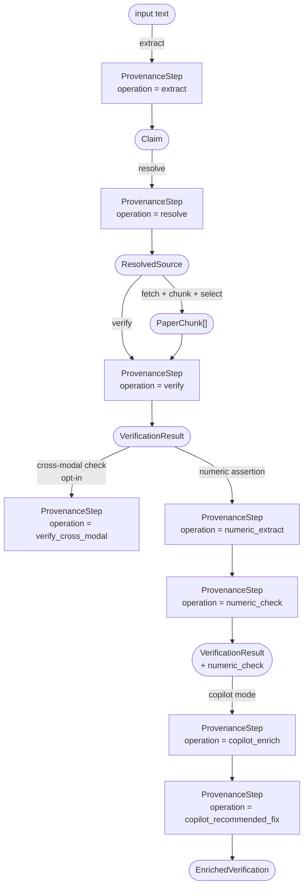
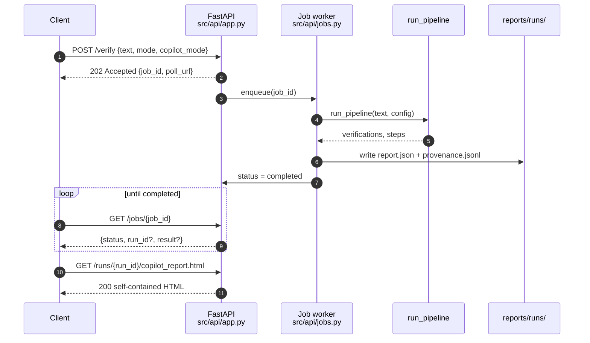

# Architecture

End-to-end diagrams for the verification pipeline. Use this doc to understand
*how* a claim flows from input text to a `report.json` entry. For the on-disk
shape of that entry, see [output-schema.md](output-schema.md).

All diagrams are GitHub-flavored mermaid; they render directly on github.com
and on the Copilot-served HTML view of this file.

---

## 1. End-to-end pipeline

**Legend** — yellow = LLM call · green = deterministic Python · blue = I/O.

Deterministic steps stay LLM-free by design: no LLM may be added to
chunk-selection, audit-trail fallback, numeric checks, or aggregation.
Same input always produces the same verdict.

---

## 2. Verifier routing

The router in [src/pipeline.py](../src/pipeline.py) picks a verifier mode
based on what was retrieved for the cited source. Each mode has different
correctness and cost characteristics.

Hard caps (deterministic post-LLM):

- `title_only` mode → verdict capped at `partially_supported`, confidence ≤ 0.7.
- `citing_paper_context` mode → verdict capped at `partially_supported`, confidence ≤ 0.6.
- `multi_source` mode → aggregator returns `partially_supported` whenever any
  one source disagrees with another (cross-modal disagreement philosophy
  applied to multi-source).

---

## 3. Audit-trail fallback

When the verifier sees BM25 passages but doesn't quote any (e.g. parse error or low confidence), the fallback below preserves the audit trail so a reviewer can still inspect what was shown to the LLM.

The blue path surfaces the BM25 chunks as `passages_searched_no_quote` instead of dropping them as `no_evidence`, so the auditor sees what the pipeline saw.

CTran impact across 135 claims on 5 benchmarks: **48.9% → 65.9% (+17pp)**.
Per-benchmark breakdown: see the CTran table in
[benchmarks/real_outputs/README.md](../benchmarks/real_outputs/README.md#claim-transparency-ctran).

---

## 4. Provenance graph for one claim

Every step that touches a claim emits a `ProvenanceStep` with input/output
hashes, model id, tokens, and cache state. The `claim_id` field links every
step back to the `claims[]` entry in `report.json`.

Replay invariant: re-running the pipeline on the same input text with the
same model should produce identical `input_hash` / `output_hash` chains for
the deterministic steps. LLM steps drift, but the chain shape is preserved.

Provenance schema (Phase 0–3): JSONL append at
`reports/runs/{run_id}/provenance.jsonl`; graph DB deferred to Phase 4+.

---

## 5. HTTP API request lifecycle

Phase C deployment exposes the pipeline behind FastAPI with async jobs so
calls don't time out at any reverse proxy.

The `/runs/{run_id}/copilot_report.html` endpoint reads the `report.json`
under `reports/runs/{run_id}/` and renders the Copilot HTML view documented
in [output-schema.md §6](output-schema.md#6-copilot-enrichment).

Hardening: container runs as non-root uid 10001, `read_only: true`, `cap_drop: ALL`,
exact-pinned Python deps, all endpoints (except `/health`) require
`X-API-Key`. Single-tenant Phase C; Postgres-backed multi-tenant `JobStore`
is deferred to Phase D.

---

## See also

- [output-schema.md](output-schema.md) — on-disk shape of `report.json` entries
- [src/models.py](../src/models.py) — frozen dataclasses, type-checked
- [src/pipeline.py](../src/pipeline.py) — verifier routing logic
- [src/verify.py](../src/verify.py) — verifier modes + audit-trail fallback
- [benchmarks/real_outputs/README.md](../benchmarks/real_outputs/README.md#claim-transparency-ctran) — CTran baseline + lift
